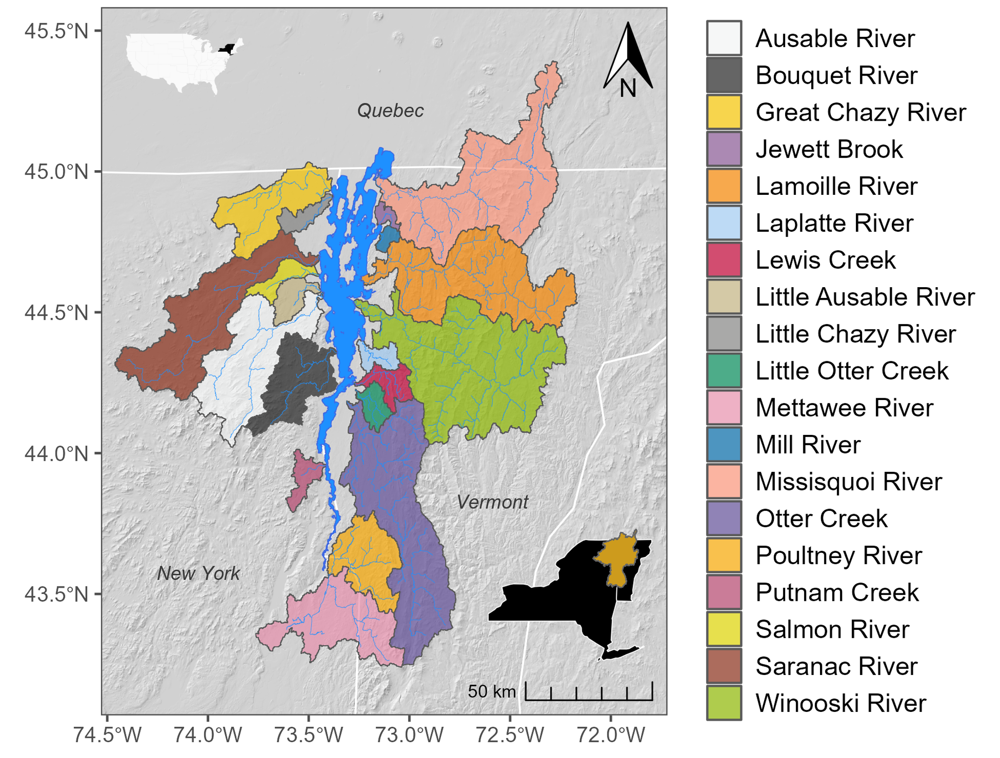

# phos-chloride-forecasting
Developing models and forecasting phosphorus and chloride in the Lake Champlain basin, Vermont &amp; New York

## Overview

This repository is home to a sequence of scripts that can be used to develop forecasts of total phosphorus and chloride from National Water Model streamflow forecasts. This is intended as a proof-of-concept for a more general approach: utilizing monitoring datasets and machine learning algorithms to build nutrient and other water quality forecasts from large-scale streamflow forecasting models. The testbed for this approach is the Lake Champlain Basin of Vermont and New York, USA, and southern Quebec, CA (Fig. 1), where water quality and streamflow monitoring data span a 30+ year period from 1990-present. 

<figcaption> <b>Figure 1.</b> The Lake Champlain Basin and major tributaries. </figcaption>

## Contents
* [**00_functions**](https://github.com/jtkemper/phos-chloride-forecasting/blob/main/00_functions.md): This is where all the functions live
* [**01_data_discovery_and_download**](https://github.com/jtkemper/phos-chloride-forecasting/blob/main/01_data_discovery_and_download.md): This script downloads flow data from the pre-selected gages of interest. It also discovers stations with water quality data gathered by Vermont DEC corresponding to each of the streamflow gages and downloads that data.
* [**02_watershed_attributes_download.md**](https://github.com/jtkemper/phos-chloride-forecasting/blob/main/02_watershed_attributes_download.md): This script downloads various static watershed attributes for each individual watershed in the Lake Champlain Basin. It draws from a variety of sources, including the National Hydrography Dataset (high- and medium-res), US (SSURGO) and Canadian soils datasets, USGS StreamStats, a USGS-built set of expanded for the NHD (Wieczorek et al., 2018, https://doi.org/10.5066/F7765D7V.), and several other publically available datasets.
* [**03_observational_data_prep.md**](https://github.com/jtkemper/phos-chloride-forecasting/blob/main/03_observational_data_prep.md): This script manipulates and cleans the observational data (discharge, water quality) in order to get it ready for model construction.
* [**04_model_development.md**](https://github.com/jtkemper/phos-chloride-forecasting/blob/main/04_model_development.md): This script builds boosted regression trees (specifically, the LightGBM implementation) to forecast total phosphorus and chloride concentration in 18 tributary watersheds to Lake Champlain (see Fig. 1).
* [**05_forecast_data_download.md**](https://github.com/jtkemper/phos-chloride-forecasting/blob/main/05_forecast_data_download.md): This script downloads archived operational National Water Model (NWM) hydrological streamflow forecasts for user-specified sites from a publicly accessible Google Cloud archive.
* [**06_forecast_data_prep.md**](https://github.com/jtkemper/phos-chloride-forecasting/blob/main/06_forecast_data_prep.md): This script prepares various dataframes to make total phosphorus and chloride predictions from NWM forecasts in each basin.
* [**07_make_forecasts.md**](https://github.com/jtkemper/phos-chloride-forecasting/blob/main/07_make_forecasts.md): This script takes the models we have trained on observational streamflow and watershed characteristic data, as well as the dataframes we have prepared with National Water Model forecast data, to make forecasts of total phosphorus and chloride concentration from those streamflow forecasts.

## How to use this repo

Users interested in using this repository to forecast constituent concentrations in their basins of interest should run these scripts in order, making changes to user-specified locations where necessary (USGS Gage IDs, COMIDs, etc.). To reconstruct forecasts made in Kemper et al., scripts should be run in order without modification. Instructions on how to use each script are included within the file.
