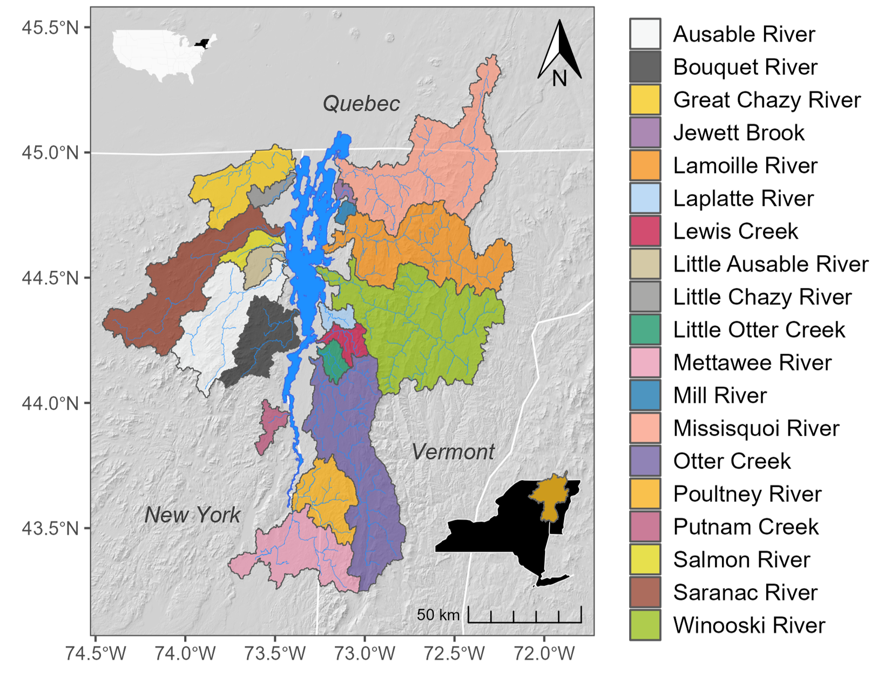

# phos-chloride-forecasting
Developing models and forecasting phosphorus and chloride in the Lake Champlain basin, Vermont &amp; New York

## Overview

This repository is home to a sequence of scripts that can be used to develop forecasts of total phosphorus and chloride from National Water Model streamflow forecasts. This is intended as a proof-of-concept for a more general approach: utilizing monitoring datasets and machine learning algorithms to build nutrient and other water quality forecasts from large-scale streamflow forecasting models. The testbed for this approach is the Lake Champlain Basin of Vermont and New York, USA, and southern Quebec, CA (Fig. 1), where water quality and streamflow monitoring data span a 30+ year period from 1990-present. 

<figcaption> <b>Figure 1.</b> The Lake Champlain Basin and major tributaries. </figcaption>

## Specific files
